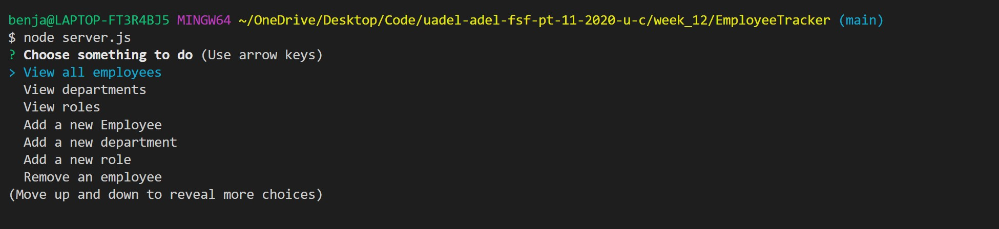
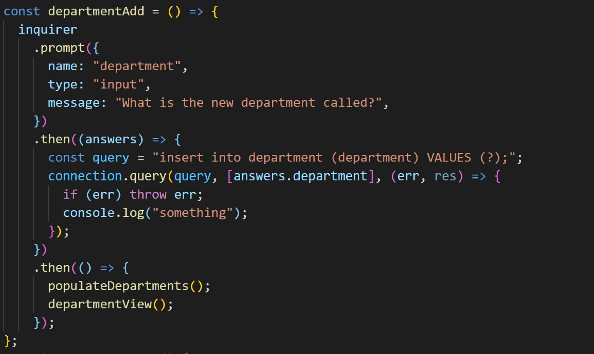

# Employee Tracker

## Description

This project uses the node packages inquirer, sequalize and dotenv to assist with the use of mySQL. Using mySQL, data is stored and saved there. The mySQL package allows data from node.js to be added and removed from the database. When the application is started, the user is provided with options to veiw, change, add and delete data to do with the workplace

## Table Of Contents

- [Installation](##Installation)
- [Usage](##Usage)
- [License](##License)
- [Contributing](##Contributing)
- [Tests](##Tests)
- [Questions](##Questions)

## Installation

When the application is started, data from the mySQL database is added to arrays such as the name and id of the roles, departments and employees. The init function is run prompting the user to choose whether to: Veiw, update, add or delete employees, roles or departments, view the wage total of the workplace, or, finally, veiw or change the manager of each employee. Each time they choose an action they are given the neccessary prompts for the data be manipulated and displayed for the user. Then the initial set of options is displayed until the user decides to exit the application

## Usage

The above image is of the initial options the user has. Each time the user finishes an action, they are taken back to here

The above image is ana example of one of the functions the user can choose that uses the connection to mysql to store and retrieve data

[link to example video](https://drive.google.com/file/d/1YIg4mal2VZNdjl0lFuC1x4Xo42V19kiV/view)

## License

This project is covered under the MIT License

## Contributing

[bencyna](https://github.com/bencyna/)

## Tests

Run the following command into the root directory: `node server.js`

## Questions

If you have any questions about this project, you can veiw my github account at https://github.com/bencyna or email me at benjamincyna@gmail.com
